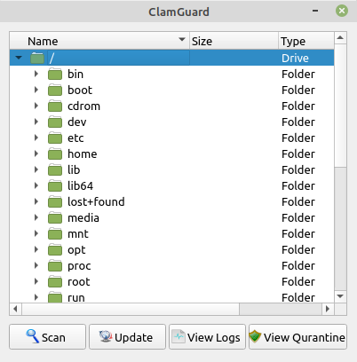
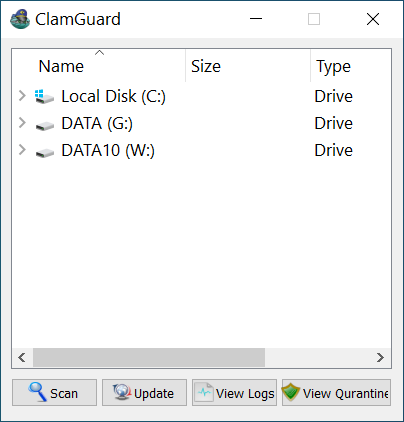
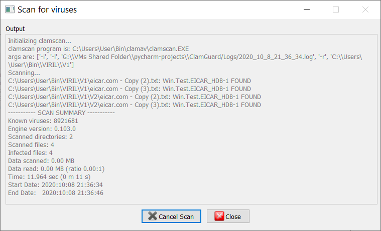
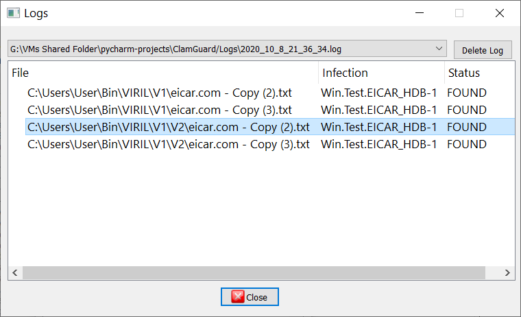
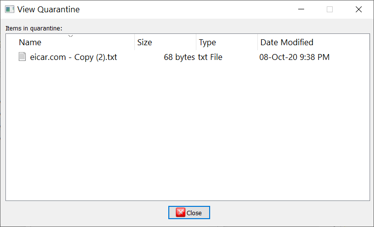

# ClamGuard

ClamGuard is a python3 GUI for the famous antivirus ClamAV.

You can run it on Windows, Linux and Mac computers.

## Screenshots











## Requirements

### Windows

- Download the clamav for windows.

- Configure clamav for windows according clamav instructions.

- Put the clamscan and freshclam paths to PATH enviroment variable in Windows.

- Download [Which for Windows](http://gnuwin32.sourceforge.net/packages/which.htm) and installe it.

- Put the which path to PATH enviroment variable in Windows.

- Download python3.9 or greater https://www.python.org/downloads/windows/ for windows and install it.

- Install PyQt5. pip install PyQt5

### Linux/Mac

- Install clamav

- Configure clamav according clamav instructions

- Install python3.9 or greater

- Install PyQt5. pip install PyQt5

To run the application run the ClamGuard.py script

```bash
python3.9 ClamGuard.py
```


